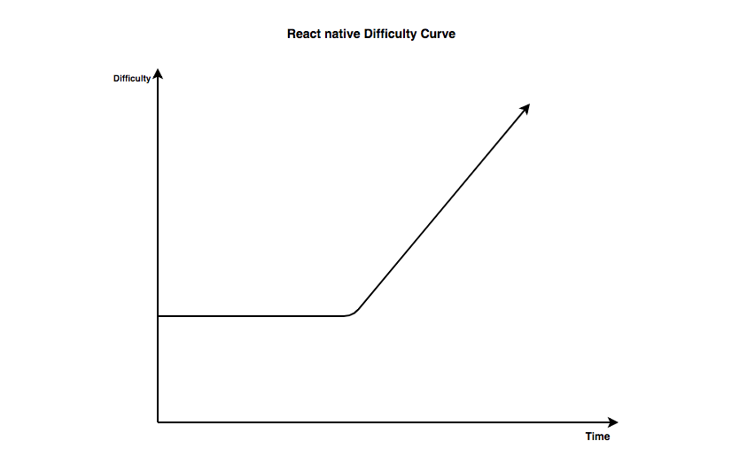

## Be Ready

It is commonly known that most of React Native developers are also web developers. More than 70% of React Native developers have been working on web development and Reactjs stuff. If it’s your case — probably it is — then I am sorry to tell you that you are going to miss your amazing Web development experience. Because the experience on mobile will not be the same.

That doesn’t mean that React Native is not ready yet, but I think this because of the amazing stuff that happened on the web platform every Day. However, I guarantee you that this experience will be much fun than developing on Native languages ( Android and swift ).

## React Native Difficulty Curve ( Is React native difficult ?)

If you are familiar with Reactjs in the web, well you are exactly where you are supposed to be! If not, I think the best way to start with React Native is to build a simple React web project so you can learn some fundamental Reactjs and Reactjs ecosystem stuff without suffering from platform issues that can block your React Native fresh learning path.

The next important idea that I want to highlight in this section is the Difficulty Curve, and when you will find the difficulty during your React Native project.

As a developer with Reactjs background, I believe that we start with few struggles with React Native. Getting something to just appear on the screen is straightforward, it’s not challenging but anything more complicated like start navigation or some native challenging stuff, You are going to start using some third-party libraries. And using some of them will not be the best experience you’d like.

The graph below explains exactly my React Native experience. When I start a new project with some basic stuffs it looks like ‘’wait what is simple like that ‘’. Then, after using some third party libs, the project’s progress goes slowly and I face many problems related to those libs upgrades. It’s a normal thing because maintaining a React Native open source project is not a simple task. You need to have a strong background in Javascript, Java, and Swift. Those third-party libs are developed by great people who might be doing this as a hobby. They have not been paid for them so the quality is not always at its peak. (Speaking of it, I want to give credits to the React Native community for their great work!)

## React Native init vs expo

To start a new project with React Native you need Android Studio and XCode. Android Studio means a java environment setup. XCode means you simply need to have a MAC Laptop, yea !! when the expo comes to the React Native ecosystem, they introduce a new way to build a whole mobile app without even using Android Studio or Xcode.

Just to give you an idea of the setup time, here are some really rough estimates based on my experience:

#### macOS

- Expo on physical device: ~10 minutes (Android or iOS)
- Expo on iOS simulator: ~1 hour
- Expo on Android emulator: ~1.5 hours
- Plain React Native on physical device: ~2 hours (Android or iOS)
- Plain React Native on iOS simulator: ~2 hours
- Plain React Native on Android emulator: ~2 hours

#### Windows or Linux

- Expo on physical device: ~20 minutes (Android or iOS)
- Expo on iOS simulator: ❌
- Expo on Android emulator: ~2 hours
- Plain React Native on physical device: ~2.5 hours (Android only)
- Plain React Native on iOS simulator: ❌
- Plain React Native on Android emulator: ~3 hours

### TypeScript 🤔

In the last couple of years, typescript gains a lot of popularity among the react community. We start seeing more and more people tweeting about using typescript as a default language for their react project. This fact convinces more people to use typescript and start asking about the best way to learn it.

It is important to know that typescript is only a superset of JavaScript, which primarily provides optional static typing, classes, and interfaces. This means you are not going to learn an entirely new language.

I start working with typescript for React Native a year ago. I would see that using typescript is super useful to help write clean and secure code. Still, it’s a little bit confusing in the first days as I found myself dealing with typing more than application logic, but after that, I can’t see myself creating a new project without typescript.

In case you are interested to learn typescript for react Make sure to read my article about [How to learn TypeScript for react developers](https://elazizi.com/how-to-learn-type-script-for-react-developers)
