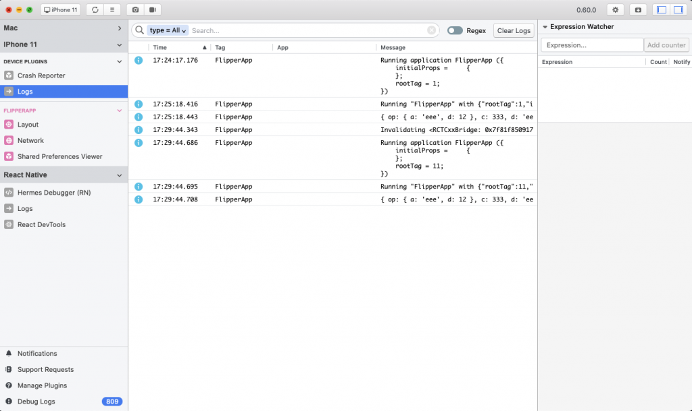

We have multiple way to debug a React Native Application as [the official Docs ](https://reactnative.dev/docs/debugging) suggest: Console, Chrome Developer Tools, Safari Developer Tools, ReactTron and more,

> 🔥 Starting from React Native 0.62, Flipper is the best choice for debugging a React Native Application.

[Flipper](https://fbflipper.com/) It’s an open-source debugging tool made by Facebook for mobile apps – both for iOS and Android. It existed for quite some time, but it has not been widely used. However, it can change with the release of React Native 0.62, which has Flipper integrated by default.

Flipper is using remote debugging, which lets the app run in the environment as close to production one as possible. It gives you more confidence when debugging apps in comparison to direct debugging.

But the biggest advantage of Flipper which differs it from other debugging tools is plugin library that allows you to install plugins directly from Flipper interface and extend its capabilities. You can also make your plugins and share them! But let’s go from the start.

## How to start using Flipper

As I mentioned at the beginning, if your app is using React Native 0.62+, you already have Flipper integration in your app. Just install Flipper, and you are good to go!.

If you are using older versions, there are some additional steps to make Flipper work with your app. Follow these URLs for both iOS and Android.

## First steps

This is what you will see after starting Flipper (assuming you are running a React Native app on your machine or connected device).

From here you can access things like:

- Crash Reporter – Logs from crashes
- Logs (which consist of logs from js and native logs without the need to launch Xcode or Android Studio)
- Layout – the equivalent of Elements browser from Chrome debug console
- Network – lets you browse all your incoming/outgoing network requests
- Shared Preferences Viewer – this lets you view and edit shared preferences
- Hermes Debugger – debugger for Android apps using Hermes
- React DevTools – whole React DevTools as a plugin inside Flipper
