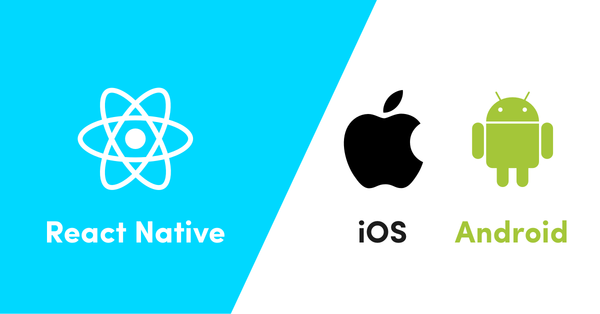

> 👋 Hello, and welcome to the Practical React Native Course.

## What You Can Expect

I Build React Native App for 3 years now, my main goal in those few days is to give you an idea of how I do it - what are the best practices, conventions, do's, and dont's. By the end of the course, you’ll be comfortable writing React Native App.

## What You’ll Need to Know ?

This course is targeted at beginner/intermediate developers.

If you already know React, that's perfect, since your React skills are completely transferrable to React Native.

You’ll need to have the following skills to get the most out of the course:

- Command-line experience in any operating system.
- Coding experience in Javascript.
- Reactjs beginner skills.

If it not the case, this [Beginner's Guide to React course](https://egghead.io/courses/the-beginner-s-guide-to-react) by the amazing [Kent C. Dodds](https://egghead.io/instructors/kent-c-dodds) will help you build a solid understanding about react.

In this course, I will be using a MacBook Pro, an iPhone simulator and an Android emulator from Android Studio.

To follow this course you should have:

- A Mac, Windows or Linux machine
- A physical device (iPhone or Android) OR a simulator/emulator installed

To get the most out of the course, follow this guide, and make sure to practice what you are learning as possible as you can.

## YOUR INSTRUCTOR

  <strong>  Youssouf EL Azizi </strong>

I'm a full-stack engineer and mobile tribe lead at [Obytes](https://www.obytes.com/). Currently working with helping my team produce good quality Apps.

I blog from time to time about my journey as a developer. [My blog posts](https://elazizi.com/blog) have had over 300k reads and have been featured on Dev’s top 7, Medium top 20 recommended stories.

I'm actively involved in the open-source community as a maintainer and contributor. Maintaining 10M downloads/year and 1k stars on GitHub react component package and submitting some PRs to projects I usually use such us react-native and Gatsbyjs.

I'm also a [DevC Casablanca co-lead](https://www.facebook.com/groups/DevC.Casablanca/), I do my best sharing my knowledge and helping with events organization.

When I am not coding you can find me playing football or having fun with friends.

### Stay in touch

- [@ElaziziYoussouf](https://twitter.com/ElaziziYoussouf)
- [LinkedIn](https://www.linkedin.com/in/youssouf-elazizi/)
- GitHub where you can find the code for this site and [my other open-source projects](https://github.com/yjose/)

## Contributing

Find a typo or error? This course is open-source; make a [Pull Request](https://github.com)!

## Credit

This workshop (concept, content, and structure) is heavily inspired the work of those amazing people:

- [Next.js Course](https://github.com/Hendrixer/nextjs-course)
- [React Native Fundamentals](https://github.com/ReactNativeSchool/react-native-fundamentals)
- [Kadi Kraman React Native Course](https://kadikraman.github.io/)

Thank you for putting it together and sharing it publicly.
