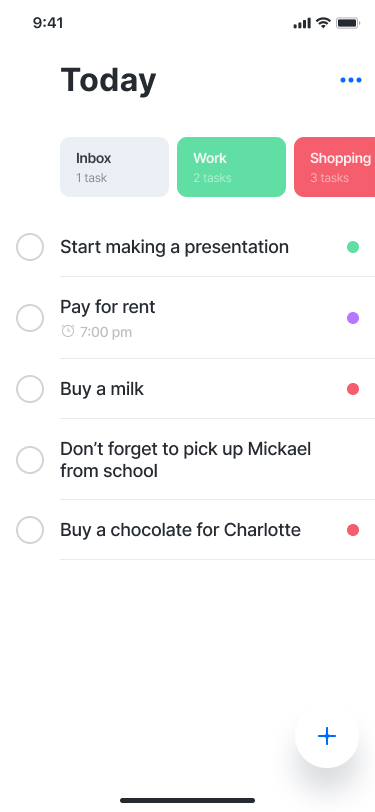

React Native provides a suite of components for presenting lists of data. Generally, you'll want to use either FlatList or SectionList.

## FlatList

The `FlatList` component requires two props: `data` and `renderItem`.

- `data` is the source of information for the list.
- `renderItem` takes one item from the source and returns a formatted component to render.

```jsx
import React from "react";
import { FlatList, StyleSheet, Text, View } from "react-native";

const FlatListBasics = () => {
  return (
    <View style={styles.container}>
      <FlatList
        data={[
          { key: "Devin" },
          { key: "Dan" },
          { key: "Dominic" },
          { key: "Jackson" },
          { key: "James" },
          { key: "Joel" },
          { key: "John" },
          { key: "Jillian" },
          { key: "Jimmy" },
          { key: "Julie" },
        ]}
        renderItem={({ item }) => <Text style={styles.item}>{item.key}</Text>}
      />
    </View>
  );
};

const styles = StyleSheet.create({
  container: {
    flex: 1,
    paddingTop: 22,
  },
  item: {
    padding: 10,
    fontSize: 18,
    height: 44,
  },
});
```

## SectionList

SectionList is a similar to FlatList, but it allows you to render items in sections with a header item between. The `data` for the `SectionList` is still an array, but each array item will need to be an object with a title (a string) and a data (an array) prop.

Additionally, you can pass in a prop called `renderSectionHeader` which will let you render the title for each section.

```jsx
import React from "react";
import { SectionList, StyleSheet, Text, View } from "react-native";

export const SectionListExample = () => {
  return (
    <View style={styles.container}>
      <SectionList
        sections={[
          { title: "D", data: ["Devin", "Dan", "Dominic"] },
          {
            title: "J",
            data: [
              "Jackson",
              "James",
              "Jillian",
              "Jimmy",
              "Joel",
              "John",
              "Julie",
            ],
          },
        ]}
        renderItem={({ item }) => <Text style={styles.item}>{item}</Text>}
        renderSectionHeader={({ section }) => (
          <Text style={styles.sectionHeader}>{section.title}</Text>
        )}
        keyExtractor={(item, index) => index}
      />
    </View>
  );
};
```

### React Native Lists Features

flat lists, supporting the most handy features:

- Fully cross-platform.
- Optional horizontal mode.
- Configurable viewability callbacks.
- Header support.
- Footer support.
- Separator support.
- Pull to Refresh.
- Scroll loading.
- ScrollToIndex support.
- Multiple column support.

### List props

The list elements have a bunch of built in properties to help customize for your experience. Check out the [FlatList](https://reactnative.dev/docs/flatlist) and [SectionList](https://reactnative.dev/docs/sectionlist) docs for all of them. Here are some I tend to use most often:

- `ItemSeparatorComponent`- renders a custom separator between your items. Handy if you have to e.g. render a line or even something dynamic instead of building it into the list items
- `ListEmptyComponent` - this is rendered when the data is an empty array or undefined. Saves you from doing conditional rendering manually!
- `ListFooterComponent` - renders something at the bottom of the list
- `ListHeaderComponent` - renders something at the top of the list
- `extraData` - the list only gets re-rendered if the DATA changes. It might happen though that what you display depends on some external factors. In this case use the extraData to pass in any variables that should also trigger a re-render when changed
- `horizontal` - render the list horizontally instead of vertically
- `numColumns` - render multiple columns
  onEndReached - fires when the user has scrolled to the end of the list. Handy for pagination

## 🧑‍💻 Exercise

Implement the `Home` Screen using FlatList Component.



> Create a new folder for `Home` screen under `screens`.

use the following snippets 👇:

```tsx
// src/Home/Categories.tsx
import * as React from "react";
import { StyleSheet, View, Text, FlatList } from "react-native";

type CategoryType = {
  label: string;
  total: number;
  color: string;
};

const data: CategoryType[] = [
  { label: "inbox", total: 2, color: "#EBEFF5" },
  { label: "work", total: 2, color: "#61DEA4" },
  { label: "Shopping", total: 3, color: "#F45E6D" },
  { label: "Family", total: 1, color: "#FFE761" },
  { label: "Personal", total: 4, color: "#B678FF" },
];

const CategoryItem = () => {
  return (
    <View style={styles.item}>
      <Text style={styles.label}>label</Text>
      <Text style={styles.total}>total task</Text>
    </View>
  );
};

export const Categories = () => {};

const styles = StyleSheet.create({
  item: {
    padding: 12,
    paddingRight: 24,
    borderRadius: 8,
    margin: 4,
    minWidth: 100,
  },
  label: {
    color: "#252A31",
    fontSize: 16,
    fontWeight: "bold",
  },
  total: {
    color: "#252A31",
    fontSize: 12,
    opacity: 0.5,
  },
});
```

```tsx
// src/Home/Tasks.tsx
import * as React from "react";
import { StyleSheet, View, Text, FlatList } from "react-native";

type TaskType = {
  label: string;
  done: boolean;
  color: string;
};

const data: TaskType[] = [
  { label: "Start making a presentation", done: false, color: "#EBEFF5" },
  { label: "Pay for rent", done: false, color: "#61DEA4" },
  { label: "Buy a milk", done: false, color: "#F45E6D" },
  {
    label: "Don’t forget to pick up Mickael from school",
    done: true,
    color: "#FFE761",
  },
  { label: "Buy a chocolate for Charlotte", done: false, color: "#B678FF" },
];

const TaskItem = () => {
  return (
    <View style={styles.item}>
      <View style={styles.done} />
      <Text style={styles.label}>{label}</Text>
      <View style={styles.circle} />
    </View>
  );
};

export const Tasks = () => {};

const styles = StyleSheet.create({
  item: {
    flexDirection: "row",
    alignItems: "center",
  },
  itemContent: {
    flex: 1,
    paddingVertical: 24,
    flexDirection: "row",
    alignItems: "center",
    borderBottomColor: "rgba(0,0,0,0.1)",
    borderBottomWidth: 1,
  },
  label: {
    color: "#252A31",
    fontSize: 18,
    flex: 1,
  },
  icon: {
    justifyContent: "center",
    paddingHorizontal: 16,
  },
  circle: {
    width: 12,
    height: 12,
    borderRadius: 12,
    marginHorizontal: 16,
  },
  title: {
    color: "#252A31",
    fontSize: 34,
    fontWeight: "bold",
    paddingVertical: 20,
  },
});
```

> Use [react-native-svg](https://github.com/react-native-svg/react-native-svg) & [SVG to JSX Figma plugin](https://www.figma.com/community/plugin/749818562498396194/SVG-to-JSX) for svg icons.
