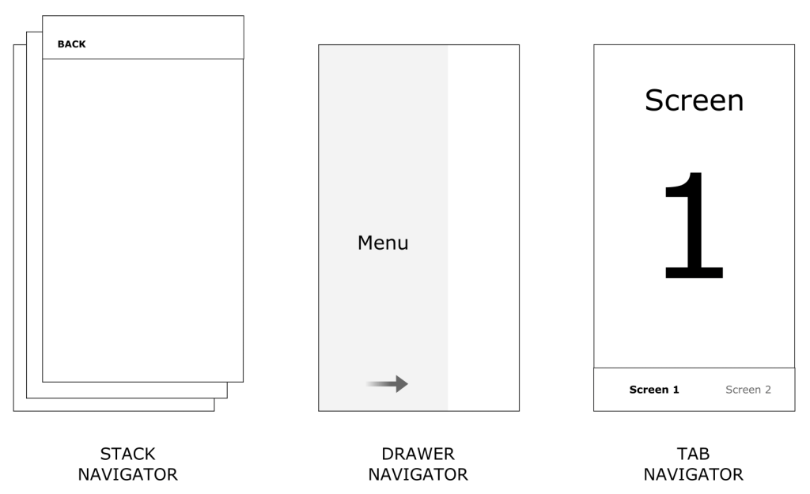

In a web browser, you can link to various pages using an anchor `<a>` tag. When the user clicks on a link, the URL is pushed to the browser history stack.

When the user clicks on the back button, the browser displays the item from the top of the history stack, so the current page is now the previously visited page.

React Native doesn’t have a built-in concept of a global history stack like a web browser does; this is where React Navigation comes in handy.

React Navigation’s stack navigator implements a way for your app to transition between screens and maintain navigation history.

A significant variation between how this runs in a web browser and React Navigation is that React Navigation’s stack navigator produces the gestures and animations that you would require on Android and iOS devices when navigating between routes or screens in the stack.

## Instalation

Install the required packages in your React Native project:

```bash
npm install react-native-reanimated react-native-gesture-handler react-native-screens react-native-safe-area-context @react-native-community/masked-view
```

you need to install the pods ( for IOS) and rebuild Application:

```bash
yarn setup:ios

yarn ios

```

To finalize installation of `react-native-gesture-handler`, add the following at the top (make sure it's at the top and there's nothing else before it) of your entry file, such as `index.js`or `App.js`:

```jsx
import "react-native-gesture-handler";
```

Now, we need to wrap the whole app in NavigationContainer. Usually you'd do this in your entry file, such as index.js or App.js:

```jsx
import "react-native-gesture-handler";
import * as React from "react";
import { NavigationContainer } from "@react-navigation/native";

export default function App() {
  return (
    <NavigationContainer>{/* Rest of your app code */}</NavigationContainer>
  );
}
```

## Navigator Components

There are 3 main navigators that React Navigation comes bundled with, that are suitable for both iOS and Android based projects.



### [Stack Navigator](https://reactnavigation.org/docs/stack-navigator)

The most vanilla navigator you’ll find, a Stack navigator will navigate from screen to screen in a hierarchical fashion:

To set up a stack navigator, declare a stack navigator object via the `createStackNavigator` method. From here, the `Navigator` and `Screen` components derived from this method can be used to embed and wrap your desired screens:

```tsx
import * as React from "react";
import { View, Text } from "react-native";
import { NavigationContainer } from "@react-navigation/native";
import { createStackNavigator } from "@react-navigation/stack";

function HomeScreen() {
  return (
    <View style={{ flex: 1, alignItems: "center", justifyContent: "center" }}>
      <Text>Home Screen</Text>
    </View>
  );
}

const Stack = createStackNavigator();

function App() {
  return (
    <NavigationContainer>
      <Stack.Navigator>
        <Stack.Screen name="Home" component={HomeScreen} />
      </Stack.Navigator>
    </NavigationContainer>
  );
}

export default App;
```

### [Bottom Tabs Navigator](https://reactnavigation.org/docs/bottom-tab-navigator)

Possibly the most common style of navigation in mobile apps is tab-based navigation. This can be tabs on the bottom of the screen or on the top below the header (or even instead of a header).

The following example demonstrates how to construct a Bottom Tabs navigator:

```jsx
import * as React from "react";
import { Text, View } from "react-native";
import { NavigationContainer } from "@react-navigation/native";
import { createBottomTabNavigator } from "@react-navigation/bottom-tabs";

function HomeScreen() {
  return (
    <View style={{ flex: 1, justifyContent: "center", alignItems: "center" }}>
      <Text>Home!</Text>
    </View>
  );
}

function SettingsScreen() {
  return (
    <View style={{ flex: 1, justifyContent: "center", alignItems: "center" }}>
      <Text>Settings!</Text>
    </View>
  );
}

const Tab = createBottomTabNavigator();

export default function App() {
  return (
    <NavigationContainer>
      <Tab.Navigator>
        <Tab.Screen name="Home" component={HomeScreen} />
        <Tab.Screen name="Settings" component={SettingsScreen} />
      </Tab.Navigator>
    </NavigationContainer>
  );
}
```

### [Drawer Navigator](https://reactnavigation.org/docs/drawer-navigator)

Another useful navigator that allows screens to animate from one side of the screen to be revealed, and animate back when closed. Stack navigators can be nested within these types of navigators to expand on the content within it:

To use this drawer navigator, import it from @react-navigation/drawer: (swipe right to open)

```jsx
import * as React from "react";
import { Button, View } from "react-native";
import { createDrawerNavigator } from "@react-navigation/drawer";
import { NavigationContainer } from "@react-navigation/native";

function HomeScreen({ navigation }) {
  return (
    <View style={{ flex: 1, alignItems: "center", justifyContent: "center" }}>
      <Button
        onPress={() => navigation.navigate("Notifications")}
        title="Go to notifications"
      />
    </View>
  );
}

function NotificationsScreen({ navigation }) {
  return (
    <View style={{ flex: 1, alignItems: "center", justifyContent: "center" }}>
      <Button onPress={() => navigation.goBack()} title="Go back home" />
    </View>
  );
}

const Drawer = createDrawerNavigator();

export default function App() {
  return (
    <NavigationContainer>
      <Drawer.Navigator initialRouteName="Home">
        <Drawer.Screen name="Home" component={HomeScreen} />
        <Drawer.Screen name="Notifications" component={NotificationsScreen} />
      </Drawer.Navigator>
    </NavigationContainer>
  );
}
```

### Nesting Navigators

It is common to nest navigators within other navigators, and navigate from one to another. Consider the following setup where a stack navigators are nested within a tab bar navigator:

```tsx
const DashboardStack = createStackNavigator();
export const Dashboard = () => {
  return (
    <DashboardStack.Navigator>
      <DashboardStack.Screen name="Home" component={HomeScreen} />
      <DashboardStack.Screen name="Stats" component={StatsScreen} />
    </DashboardStack.Navigator>
  );
};

const BottomTabs = createBottomTabNavigator();

export const Tabs = () => {
  return (
    <BottomTabs.Navigator>
      <BottomTabs.Screen name="Dashboard" component={Dashboard} />
      <BottomTabs.Screen name="Settings" component={Schedule} />
    </BottomTabs.Navigator>
  );
};
```

What if we wanted to navigate from one tab to a particular stack screen in another tab? Well, React Navigation provides a simple API to do so, using the `navigate` function within the `navigation` prop. Consider the following button:

```tsx
<Button
  label="Back Home"
  onPress={() => {
    navigation.navigate("Dashboard", {
      screen: "Stats",
    });
  }}
/>
```

## Hooks in React Navigation 5

React Navigation 5 introduction of new hooks , that make it easier to work with navigators within functional components, as well as put less (or no) reliance on HOCs.

The [`useNavigation`](https://reactnavigation.org/docs/use-navigation) : to get `navigation` object from the navigation container’s context.

```tsx
import { useNavigation } from "@react-navigation/native";

function MyComponent() {
  const navigation = useNavigation();
}
```

- [`useRoute`](https://reactnavigation.org/docs/use-route) can also be used to obtain the route object discussed in the previous section. There are a few more hooks to be aware of when upgrading from v4:

- [`useFocusEffect`](https://reactnavigation.org/docs/use-focus-effect): triggered when the screen in question is focussed. This can replace an event listener setup that you may have relied upon in previous versions.

Event listeners are still supported, but have been simplified. There are now two events of navigation, `focus` and `blur`. Before, we had `didFocus`, `willFocus`, `didBlur` and `willBlur` to play with. `focus` can be implemented within `useEffect` like so:

```jsx
let focusListener = null;
useEffect(() => {
  focusListener = navigation.addListener("focus", async () => {
    // do something
  });

  return () => {
    if (focusListener.remove !== undefined) this.focusListener.remove();
  };
}, []);
```

Notice that `focusListener` is `null` by default, as `useEffect` hooks are triggered after the component renders.

- [`useIsFocused`](https://reactnavigation.org/docs/use-is-focused) simply checks whether the current screen is focused and returns either `true` or `false`.
- [`useLinking`](https://reactnavigation.org/docs/use-linking) deals with deep linking within your app.
- Used less frequently will be the [`useNavigationState`](https://reactnavigation.org/docs/use-navigation-state) hook and [`useScrollToTop`](https://reactnavigation.org/docs/use-scroll-to-top) hook, which may be useful for particular use cases you may find yourself implementing.

## 🧑‍💻 Exercise

Create a stack screen for Tasker App with 2 screen : `Login` and `Home`

- Should render Login Screen as default screen.
- on Form submit navigate to home screen

👉 https://github.com/yjose/Tasker/commit/af1b86787e8bc4363e020e2243a025701464a5c8

### Helpful Links

- [React Navigation](https://reactnavigation.org/docs/getting-started)
